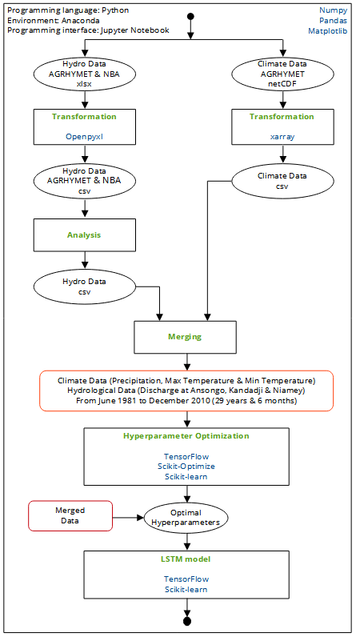

# DL-hydrological-model
Predicting Discharge in Catchment Outlet Using Deep Learning: Case Study of the Ansongo-Niamey Basin

Hi y'all! Check out here all of the codes related to my article!!

```
@inproceedings{adounkpe2021predicting,

  title={Predicting Discharge in Catchment Outlet Using Deep Learning: Case Study of the Ansongo-Niamey Basin},
  
  author={Adounkpe, Peniel J. Y. and Alamou, Eric and Diallo, Belko and Ali, Abdou},
  
  booktitle={NeurIPS 2021 Workshop on Tackling Climate Change with Machine Learning},
  
  url={https://www.climatechange.ai/papers/neurips2021/5},
  
  year={2021}
  
}
```

## Data

I used 29 years and 6 months (from June 1981 to December 2010) of daily precipitation, maximum temperature, minimum temperature and river discharge at 3 different stations: Ansongo, Kandadji and Niamey (a total of 10806 rows of data and 7 columns). I refered to climate data all data related to precipitation and temperature and to hydro data all data of river discharge.

Unfortunately, I could not share the data used in these notebooks due to sharing policies of the data providers :-(

## Description of the notebooks

The notebooks should be viewed in the following order:

- [Climate data transformation](./1_climate_data_netcdf_to_csv.ipynb): shows the different process of transforming climate data (precipitation, minimum and maximum temperature) from netCDF files of ARC to csv files
- [Hydro data transformation](./2_hydro_data_xlsx_to_csv.ipynb): shows the different process of transforming hydrological data (river discharge of 3 stations: Ansongo, Kandadji and Niamey) from xlsx files of ARC and NBA to csv files
- [Hydro data analysis](./3_hydro_data_analysis.ipynb): compares the different sources of hydrological data and fills missing data with easy and adequate interpolation method
- [Climate and hydro data merge](./4_merge_climate_and_hydro_data.ipynb): merges climate data and hydro data to have final csv to be used in DL models
- [LSTM Hyperparameter optimization](./5_hyper_parameters_lstm.ipynb): selects best hyperparameters of LSTM model
- [GRU Hyperparameter optimization](./6_hyper_parameters_gru.ipynb): selects best hyperparameters of GRU model
- [LSTM model](./7_lstm_model.ipynb): trains and tests the LSTM model
- [GRU model](./8_lstm_model.ipynb): trains and tests the GRU model
- [Other graphs](./9_additional_graphs.ipynb): plots other graphs related to the article

## Methodology

The figure below shows the summary of the methodology used in this research. The text in blue represent the modules and those in green represent the main methods used in this research. The rectangle boxes represent the different notebooks.



## Anaconda Environments

Two environments were built in Anaconda for this work **GIS** for the processing of climate data (netCDF files) and **tf** for processing of hydro data (xlsx files) and machine learning operations. All the details about the versions of the modules and environments in the following url: https://anaconda.org/Pyaj/environments

Install the environments using an Anaconda Prompt:

- for GIS environment:
```
conda env create pyaj/GIS
```
- for tf environment:
```
conda env create pyaj/tf
```
