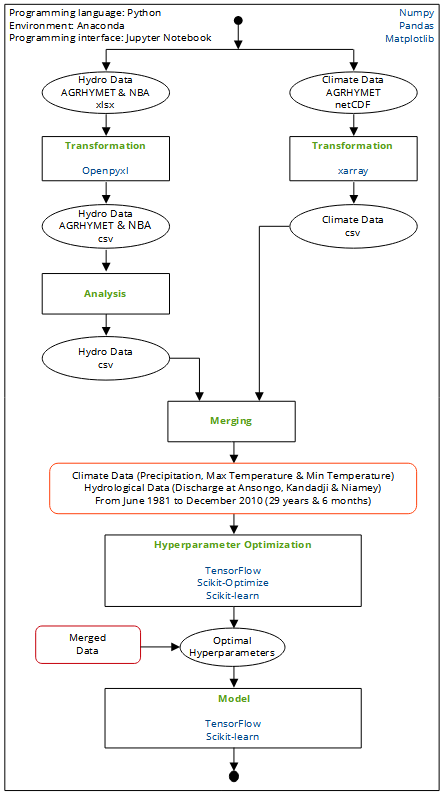

# DL-hydrological-model
 Predicting discharge in catchment outlet using deep learning methods: case study of Niamey in the Ansongo-Niamey basin

Hi y'all! Check out here all of the codes related to my master's thesis project!!

## Data

I am using 29 years and 6 months (from June 1981 to December 2010) of daily precipitation, maximum temperature, minimum temperature and river discharge at 3 different stations: Ansongo, Kandadji and Niamey (a total of 10806 rows of data and 7 columns). I would refer to climate data all data related to precipitation and temperature data and to hydro data all data on river discharge.

Unfortunately, I could not share the data used in these notebooks due to sharing policies of the data providers :-(

## Description of the notebooks

The notebooks should be viewed in the following order:

- 0_other.ipynb: this notebook was used to plot the additional data needed for the maps and figures
- 1_climate_data_netcdf_to_csv.ipynb: shows the different process of transforming climate data (precipitation, minimum and maximum temperature) from netCDF files of AGHRYMET to csv files
- 2_hydro_data_xlsx_to_csv.ipynb: shows the different process of transforming hydrological data (river discharge of 3 stations: Ansongo, Kandadji and Niamey) from xlsx files of AGHRYMET and NBA to csv files
- 3_hydro_data_analysis.ipynb: compares the different sources of hydrological data and fills missing data with easy and adequate interpolation method
- 4_merge_climate_and_hydro_dat.ipynb: merges climate data and hydro data to have final csv to be used in LSTM model
- 5_hyper_parameters_lstm.ipynb: selects best hyperparameters of LSTM model
- 6_lstm_model.ipynb: runs the LSTM model and tests its results

